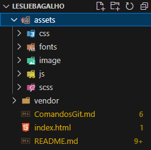

<h2>Sobre</h2>
Ola! Meu nome é Leslie Bagalho. 
Venho desde 2022, quando fiz minha migração para área de TI, me aprimorando no que tenho/venho planejado para meu futuro. 
No momento, atuo como Analista de Desenvolvimento em uma empresa automobilistica.   
 
- Crio soluções Low-Code utilizando Power Apps  
- Crio dashboards básicos utilizando Excel/Power BI 
 
Em conjunto com o setor de TI, estamos:  
- Criando plataforma para servir de base para sistemas web

<h3>Minhas redes sociais</h3>

    
    &nbsp;&nbsp;&nbsp;&nbsp;
    

<h3>Meus conhecimentos básicos/intermediários</h3>
HTML - CSS - Git - VSCode - Trello 
SharePoint - Power Apps - Power Automate - Power BI 
Excel - VBA - FIGMA - Forms

<h3>Modelo para organizar as pastas de seus projetos</h3>

Fonte: @iuricode

<h3>Link dos comandos Git para não esquecer...</h3>

    <a href="/ComandosGit.md">Comandos Git</a>

